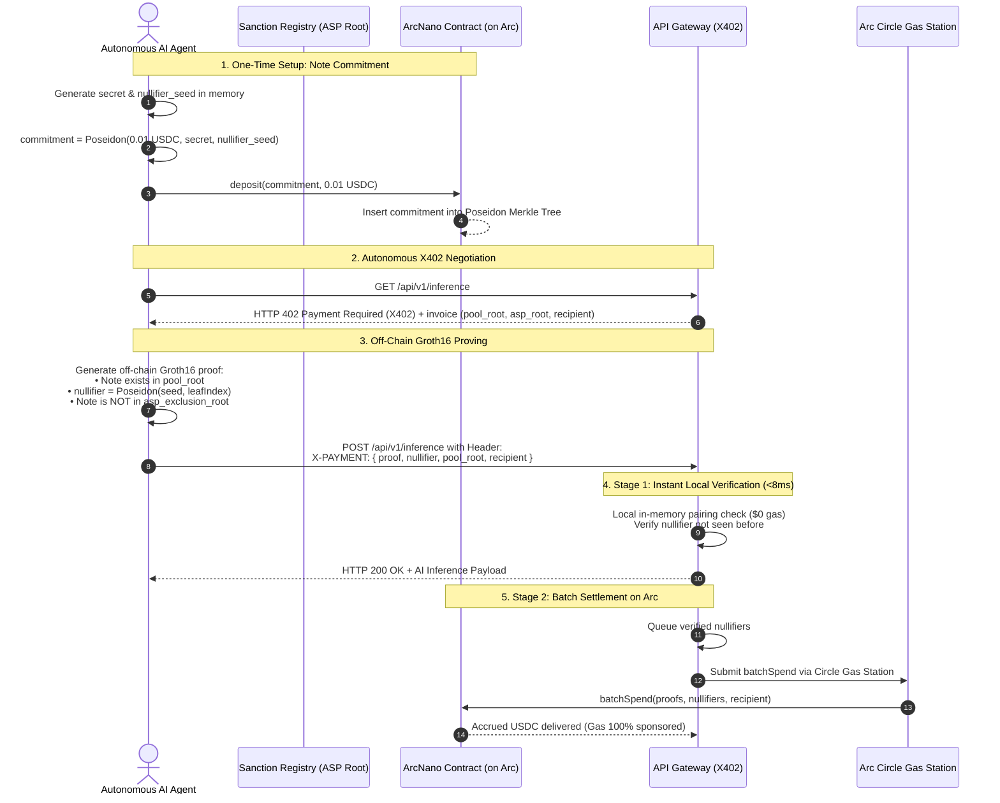

# ArcNano: Shielded Agent Nanopayments on Arc

> **An independent solo project & grant proposal for the Arc Ecosystem.**  
> **Project Name:** ArcNano (Repository: [`arcnano`](https://github.com/Trymbakmahant/arcnano))  
> **Author:** Trymbak Mahant ([@trymbakmahant](https://github.com/Trymbakmahant)) — Solo Builder  
> **Official X:** [@0xarcnano](https://x.com/0xarcnano)  
> **Category:** Zero-Knowledge Cryptography • Autonomous AI Agent Infrastructure • X402 Micropayments  
> **Target Network:** Arc (leveraging Circle Gas Station / Paymaster & native USDC)

---

## 💡 Origin Story & Why I Built This

Autonomous AI agents are beginning to transact with one another over the web using the emerging **X402 Payment Required (`X402`)** protocol standard. As an independent builder exploring the intersection of Zero-Knowledge proofs and M2M (machine-to-machine) micropayments, I noticed four fatal architectural traps in how crypto payments are currently approached for AI agents:

1. **The Surveillance Nightmare:** If an autonomous agent pays an LLM API, web-scraper, or compute oracle using standard on-chain transactions, its wallet address (`msg.sender`) permanently logs every counterpart, prompt API call, and financial pattern on-chain for competitors to analyze.
2. **The Naive ZK Trap:** Beginners often think, *"I'll just use a ZK proof to hide the payment."* But who signs the Ethereum transaction to call the smart contract? If the agent's wallet calls `spend()`, **the signer's address is broadcast to Arc's explorer**, destroying privacy on the spot.
3. **The Mixer Dilemma:** Traditional mixers like Tornado Cash pool clean and dirty funds indistinguishably, leading to regulatory bans and instant blacklisting by enterprise APIs that cannot prove non-involvement in illicit clusters.
4. **The Latency Mismatch:** Web APIs expect sub-second responses. An AI agent in an execution loop cannot wait 10–15 seconds for an on-chain block confirmation just to fetch a $0.001 inference snippet.

### The Solution: `ArcNano`
I designed this protocol from first principles to decouple payments from identity, guarantee legal compliance, and deliver instant sub-second verification by uniting:
- **Shielded Fixed-Denomination Note Pools** (Poseidon Merkle trees on Arc).
- **Association Set (ASP) Compliance Proofs** (inspired by the *Privacy Pools* standard, mathematically proving non-membership in sanctioned funds).
- **Signer Decoupling via Arc Circle Gas Station & Receiver Settlement** (the agent never broadcasts an on-chain spend transaction).
- **Two-Stage X402 Verification** (<10ms local in-memory Groth16 verification off-chain for immediate API delivery, followed by batched settlement on Arc).

---

## 🏛️ System Architecture

```
   ┌────────────────────────────────────────────────────────┐
   │                ARCNANO PROTOCOL STACK                  │
   │                                                        │
   │  [Circom + Groth16]  ──>  [ArcNano.sol]   ──>  [X402]   │
   │   Off-chain proofs        Arc Note Pool      HTTP API  │
   └────────────────────────────────────────────────────────┘
```

### Complete End-to-End Flow



---

## 🔬 Core Cryptographic & Architectural Resolutions

### 1. Breaking the Signer Link (Solving `msg.sender` Surveillance)
In naive ZK contracts, the person who spends the note calls `contract.spend(proof)`. But that means their public key is `msg.sender`.

In **ArcNano**, **the spending agent never broadcasts an on-chain transaction**:
- When an agent pays an API, it hands the complete, self-verifying Groth16 proof to the **API provider (receiver)** inside the `X-PAYMENT` header.
- The **receiver** is the one who claims the money on-chain!
- The receiver batches 20, 50, or 100 proofs together and broadcasts a single `batchSpend()` transaction to Arc.
- Because Arc supports **Circle Gas Station (Paymaster)**, the settlement transaction requires **zero native gas from the agent**. The identity link between the depositor and the spender is completely severed.

### 2. Solving the Mixer Sanctions Trap (Privacy Pools)
Legacy mixers pool clean and dirty funds indistinguishably, leading to global regulatory bans.

ArcNano enforces an **Association Set Provider (ASP) Exclusion Check**:
- Sanctioned or flagged deposit commitments are published as an exclusion Merkle tree root.
- The Circom circuit includes an exclusion constraint:
  $$\text{VerifyNonMembership}(\text{aspExclusionRoot}, \text{commitment}) == 1$$
- The agent mathematically proves: *"My note is inside the valid deposit pool, AND my note is NOT present in the sanctioned list."*
- Enterprise APIs verify compliance with mathematical certainty before fulfilling requests, remaining 100% legally compliant without doxxing the agent.

### 3. Sub-10ms API Delivery (Two-Stage Verification)
Normal blockchain transactions take seconds or minutes to confirm. For an AI agent making dozens of API calls per minute, waiting for block confirmations breaks real-time agent loops.

ArcNano utilizes a **Two-Stage Verification Model**:
- **Stage 1 (Synchronous / Off-Chain — <8ms):** The API gateway runs the Groth16 verifier (`snarkjs.groth16.verify`) in local RAM against its known Merkle root and an in-memory nullifier cache. If the math holds and the nullifier is new, the server unblocks the LLM response stream immediately.
- **Stage 2 (Asynchronous / On-Chain):** The API provider aggregates nullifiers and flushes them to Arc in batches once per hour or upon hitting a threshold, amortizing settlement costs to fractions of a cent per request.

---

## 📊 Industry Standard Benchmark (My Analysis)

| Dimension | Standard Public USDC | Tornado Cash (Mixer) | Privacy Pools (Railgun) | **ArcNano (My Project)** |
| :--- | :--- | :--- | :--- | :--- |
| **Agent Anonymity** | ❌ 0% (Fully Doxxed) | ⚠️ High (Mixed Pool) | ⚠️ High (Shielded) | ✅ **100% Zero-Knowledge** |
| **Signer Link** | ❌ `msg.sender` leaks identity | ⚠️ Needs third-party relayers | ⚠️ Relayer dependent | ✅ **Receiver-Batched + Arc Gas Station** |
| **Compliance** | ⚠️ Centralized Blacklist | ❌ OFAC Sanctioned | ⚠️ Opt-in post-proofs | ✅ **Inherent ASP Non-Membership Check** |
| **API Latency** | ❌ 2–15s block time | ❌ Multiple minutes | ❌ Multiple minutes | ✅ **< 8ms Local WASM Verification** |
| **Nanopayment Cost**| ❌ Gas > Payment amount | ❌ Prohibitive mixer fees | ❌ High single-spend gas | ✅ **Batch Amortized ($0 for agent)** |
| **HTTP Native** | ❌ Manual wallet popups | ❌ Web UI only | ❌ CLI/Wallet only | ✅ **Standardized `X-PAYMENT` header** |

---

## 🛠️ Project Structure & What I Have Built

```tree
arcnano/
├── README.md               # Project documentation, architecture & grant proposal
└── landing-page/           # Next.js 16 (Turbopack) web interface & interactive visualizer
    ├── src/
    │   ├── app/
    │   │   ├── page.tsx    # Interactive protocol blueprint, threat model & roadmap
    │   │   ├── layout.tsx  # Next.js layout, SEO metadata & Schema.org JSON-LD
    │   │   └── globals.css # Curated design tokens & architectural styling
    │   └── component/UI/   # Architectural UI Components
    │       ├── Preloader.tsx           # Branded logo preloader & telemetry sequence
    │       ├── SineRibbonBackground.tsx# Interactive mathematical sine-wave canvas
    │       └── VerticalCurvyStepper.tsx# Alternating S-curve architectural resolution
    ├── public/             # Brand assets, LLM discovery & SEO endpoints
    │   ├── arcnano-logo.png# Official ArcNano brand logo
    │   ├── llms.txt        # LLM-readable protocol architecture & context
    │   ├── llms-full.txt   # Complete cryptographic and protocol specification for AI
    │   ├── robots.txt      # Web crawler directives
    │   └── sitemap.xml     # Search engine index
    └── package.json        # Next.js 16 + React 19 + Framer Motion dependencies
```

---

## 🚀 Running the Interactive Application Locally

The project includes an interactive web testbed built with **Next.js 16 (Turbopack)**, **Tailwind CSS**, and **Framer Motion** that visualizes the entire protocol flow, threat models, and architectural resolutions.

### How to Run:
```bash
# 1. Clone the repository
git clone https://github.com/Trymbakmahant/arcnano.git
cd arcnano/landing-page

# 2. Install dependencies
npm install

# 3. Start local development server
npm run dev
```

Open [http://localhost:3000](http://localhost:3000) in your browser. You can:
1. **Experience the Branded Preloader:** See the ArcNano emblem and brand logo initialize protocol telemetry.
2. **Explore the Architectural Blueprint:** Observe the interactive mathematical sine ribbon canvas simulating zero-knowledge cryptographic state.
3. **Inspect the 4 Fatal Traps:** Review detailed threat models highlighting why public on-chain payments fail for autonomous AI agents.
4. **Follow the Alternating S-Curve Stepper:** Step through the 4 core solutions (Receiver-Batched Settlement, Circle Gas Station, ASP Proofs, and Two-Stage X402 Verification) in a responsive alternating layout.
5. **Review the Development Roadmap:** Inspect planned milestones from circuit construction to live testnet deployment on Arc.

---

## 🎯 Arc Ecosystem Grant Fit: Why Arc?

1. **Circle Gas Station (Paymaster) Integration:** Arc's native support for gas sponsorship is the missing piece that enables true anonymity for machine-to-machine payments. Without it, agents need native tokens, which re-introduces centralized exchange funding graph linkage.
2. **Native USDC Liquidity:** AI agents need stable pricing. Denominating notes in fixed USDC tiers ($0.01, $0.10, $1.00) prevents volatility during note holding.
3. **High Throughput & Low Calldata Overhead:** Batching 100 nullifiers in a single transaction on Arc costs pennies, making nanopayments economically viable for high-frequency agent loops.

---

## 🧭 Roadmap & Grant Milestones

- [x] **Milestone 1: Protocol Architecture & Interactive Application (Completed)**
  - Formulated the two-stage X402 verification model.
  - Solved `msg.sender` leakage using the receiver-batched / Gas Station design.
  - Built Next.js 16 interactive visualizer with alternating S-curve resolution stepper.
  - Implemented comprehensive LLM documentation (`/llms.txt`, `/llms-full.txt`) and SEO schema.
- [ ] **Milestone 2: Production Circom Circuit & Arc Testnet Contracts (In Progress)**
  - Finalize `spend.circom` with 20-level Poseidon Merkle tree.
  - Implement ASP exclusion proof circuit (`asp_check.circom`).
  - Deploy `ArcNanoPool.sol` on Arc Testnet.
- [ ] **Milestone 3: Agent SDK & Gateway Middleware**
  - Publish `arczk-agent` Python package for LangChain / AutoGPT / CrewAI.
  - Publish `@arczk/x402-express` middleware for API providers.
- [ ] **Milestone 4: Gas Station Relayer & Testnet Pilot**
  - Integrate Circle Gas Station for automated batch settlements.
  - Run pilot with an autonomous AI data-scraping / inference service on Arc.

---

## 🔐 Honest Disclosures & Known Limitations

As an independent researcher, I believe in transparently documenting technical trade-offs:
- **Off-chain Double-Spend Race Condition:** In Stage 1 (instant service), if a malicious agent broadcasts the same nullifier to two different API providers simultaneously, only the first provider to settle on-chain will receive the funds. Providers protect themselves by keeping single-call limits small ($0.001 - $0.01) and settling frequently.
- **Network-Level De-anonymization:** A ZK proof hides the wallet address, but sending HTTP requests directly from a static IP address can correlate requests. In production, agents should route their traffic through Oblivious HTTP (OHTTP), Tor, or proxy relays.

---

## 👨‍💻 About the Author

I am **Trymbak Mahant**, a solo software engineer and researcher passionate about Zero-Knowledge cryptography, privacy-preserving infrastructure, and the emerging autonomous agent economy.

- **GitHub:** [@trymbakmahant](https://github.com/Trymbakmahant)
- **Project Repository:** [arcnano](https://github.com/Trymbakmahant/arcnano)
- **Official X:** [@0xarcnano](https://x.com/0xarcnano)
- **License:** MIT License — Open for the Arc and Web3 builder community.
