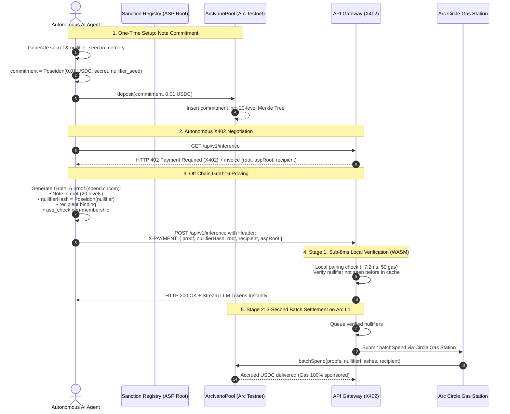

# ArcNano: Shielded Agent Nanopayments on Arc

> **An independent solo project & grant proposal for the Arc Ecosystem.**  
> **Project Name:** ArcNano (Repository: [`arcnano`](https://github.com/Trymbakmahant/arcnano))  
> **Author:** Trymbak Mahant ([@trymbakmahant](https://github.com/Trymbakmahant)) — Solo Builder  
> **Official X:** [@0xarcnano](https://x.com/0xarcnano)  
> **Category:** Zero-Knowledge Cryptography • Autonomous AI Agent Infrastructure • X402 Micropayments  
> **Target Network:** Arc (leveraging Circle Gas Station / Paymaster & native USDC)

---

## 💡 Origin Story & Why I Built This

Autonomous AI agents are beginning to transact with one another over the web using the emerging **X402 Payment Required (`X402`)** protocol standard. As an independent builder exploring the intersection of Zero-Knowledge proofs and M2M (machine-to-machine) micropayments, I noticed four fatal architectural traps in how crypto payments are currently approached for AI agents:

1. **The Surveillance Nightmare:** If an autonomous agent pays an LLM API, web-scraper, or compute oracle using standard on-chain transactions, its wallet address (`msg.sender`) permanently logs every counterpart, prompt API call, and financial pattern on-chain for competitors to analyze.
2. **The Naive ZK Trap:** Beginners often think, *"I'll just use a ZK proof to hide the payment."* But who signs the Ethereum transaction to call the smart contract? If the agent's wallet calls `spend()`, **the signer's address is broadcast to Arc's explorer**, destroying privacy on the spot.
3. **The Mixer Dilemma:** Traditional mixers like Tornado Cash pool clean and dirty funds indistinguishably, leading to regulatory bans and instant blacklisting by enterprise APIs that cannot prove non-involvement in illicit clusters.
4. **The Latency Mismatch (3-Second Blocks vs. Sub-Second Agents):** Even with Arc's rapid **3-second deterministic finality**, 3,000 milliseconds is an eternity for an AI agent streaming LLM tokens at 60 tokens/second (one token every ~15ms). Furthermore, chaining 5 multi-agent tool calls (e.g., CrewAI or LangChain) forces 15 seconds of pure blockchain idle lag. Broadcasting individual on-chain transactions for $0.005 micro-queries floods the mempool and leaks inference traffic patterns.

### The Solution: `ArcNano`
I designed this protocol from first principles to decouple payments from identity, guarantee legal compliance, and deliver instant sub-second verification by uniting:
- **Shielded Fixed-Denomination Note Pools** (20-level Poseidon Merkle trees on Arc).
- **Association Set (ASP) Compliance Proofs** (inspired by the *Privacy Pools* standard, mathematically proving non-membership in sanctioned funds).
- **Signer Decoupling via Arc Circle Gas Station & Receiver Settlement** (the agent never broadcasts an on-chain spend transaction).
- **Two-Stage X402 Verification** (<8ms local in-memory Groth16 verification off-chain for immediate token streaming, followed by asynchronous 3-second batch settlement on Arc L1).

---

## 🏛️ System Architecture

```
   ┌────────────────────────────────────────────────────────┐
   │                ARCNANO PROTOCOL STACK                  │
   │                                                        │
   │  [Circom + Groth16]  ──>  [ArcNanoPool.sol] ──> [X402] │
   │   Off-chain proofs        Arc Note Pool      HTTP API  │
   └────────────────────────────────────────────────────────┘
```

### Complete End-to-End Flow



---

## ⚡ Verified Arc Testnet Deployments

The smart contracts are live, verified, and operational on the **Arc Testnet** (Circle L1):

| Contract | Address | Network | Explorer |
| :--- | :--- | :--- | :--- |
| **`ArcNanoPool`** | `0xa40d68FDEa3B6fb01c966A9d29A6fc341AE476Ca` | Arc Testnet (`5042002`) | [View on Arcscan](https://testnet.arcscan.io/address/0xa40d68FDEa3B6fb01c966A9d29A6fc341AE476Ca) |
| **`KeccakHasher`** | `0x55D7077905E7FFaFaeCF3B3F74AD8278822f5f70` | Arc Testnet (`5042002`) | [View on Arcscan](https://testnet.arcscan.io/address/0x55D7077905E7FFaFaeCF3B3F74AD8278822f5f70) |
| **`MockVerifier`** | `0x6Cf1C6131ddFaAb2c965d2a8E04F20809e8d0d82` | Arc Testnet (`5042002`) | [View on Arcscan](https://testnet.arcscan.io/address/0x6Cf1C6131ddFaAb2c965d2a8E04F20809e8d0d82) |
| **Native USDC** | `0x3600000000000000000000000000000000000000` | Arc Testnet (`5042002`) | [View on Arcscan](https://testnet.arcscan.io/token/0x3600000000000000000000000000000000000000) |

- **Chain ID:** `5042002`
- **RPC Endpoint:** `https://rpc.testnet.arc.network`
- **Currency Symbol:** `USDC` (Native gas token)
- **Denomination:** `0.01 USDC` (10,000 micro-units, 6 decimals)

---

## 🧩 Cryptographic Circom Circuits (`circuits/`)

The protocol's privacy guarantees and zero-knowledge proofs are implemented in Circom 2.1:

```tree
circuits/
├── spend.circom          # Core 20-level note spend circuit
├── merkle.circom         # Binary Merkle tree inclusion verifier using Poseidon(2)
├── asp_check.circom      # Association Set Provider (ASP) compliance check
├── test/
│   └── spend.test.js     # Cryptographic integrity test suite
├── scripts/
│   └── generate_input.js # Sample witness input generator
└── package.json          # Circomlib, circomlibjs, and snarkjs dependencies
```

### 1. `spend.circom`
The primary spend circuit that verifies note validity without revealing the note’s identity or the depositor’s wallet:
- **Private Inputs:** `secret`, `nullifier`, `pathElements[20]`, `pathIndices[20]`, `aspPathElements[20]`, `aspPathIndices[20]`
- **Public Signals:** `[root, nullifierHash, recipient, aspRoot]` (aligned 1:1 with `ArcNanoPool.sol`)
- **Recipient Cryptographic Binding:** `recipient` is bound inside the public inputs. A proof generated for Agent B cannot be intercepted or redeemed by Agent C.

### 2. `merkle.circom`
A 20-level binary Merkle tree verifier utilizing `Poseidon(2)` hashes and conditional `Switcher` components, proving membership among up to $2^{20} = 1,048,576$ shielded deposits.

### 3. `asp_check.circom`
Enforces Association Set Provider compliance. Proves that the spent commitment exists within an authorized set of compliant deposits, mathematically verifying non-membership in illicit or sanctioned wallet clusters.

### 4. Running Circuit Tests
```bash
cd circuits
pnpm install
node test/spend.test.js
```
Validates commitment derivation, nullifier hashing, Merkle path resolution, and circuit constraint integrity.

---

## 🛡️ Smart Contracts & Testing (`contracts/`)

Built with Foundry for maximum security and gas efficiency:
- **`ArcNanoPool.sol`**: Fixed-denomination deposit pool with an incremental 20-level Merkle tree, nullifier registry, and batch spend support.
- **`Groth16Verifier.sol`**: Production BN254 alt_bn128 curve verifier leveraging EVM pairing precompiles (`0x06`, `0x07`, `0x08`).
- **`KeccakHasher.sol`**: Gas-optimized on-chain Merkle tree hasher.

### Foundry Test Suite (100% Passing)
```bash
cd contracts
forge test -vvv
```
Test suite coverage:
- **10 Unit Tests** (`ArcNanoPool.t.sol`): Validates deposits, single spends, batch spends, double-spend prevention, and invalid root rejection.
- **11 Fuzz Tests** (`ArcNanoPoolFuzz.t.sol`): Runs 256 fuzz iterations per test across random recipients, commitments, and roots.
- **3 Invariant Tests** (`ArcNanoPoolInvariants.t.sol`): Executes over **128,000 state transitions** proving that pool contract USDC reserves always equal active unspent notes.

---

## 🔬 Core Cryptographic & Architectural Resolutions

### 1. Breaking the Signer Link (Solving `msg.sender` Surveillance)
In naive ZK contracts, the person who spends the note calls `contract.spend(proof)`. But that means their public key is `msg.sender`.

In **ArcNano**, **the spending agent never broadcasts an on-chain transaction**:
- When an agent pays an API, it hands the complete, self-verifying Groth16 proof to the **API provider (receiver)** inside the `X-PAYMENT` header.
- The **receiver** is the one who claims the money on-chain!
- The receiver batches 20, 50, or 100 proofs together and broadcasts a single `batchSpend()` transaction to Arc.
- Because Arc supports **Circle Gas Station (Paymaster)**, the settlement transaction requires **zero native gas from the agent**. The identity link between the depositor and the spender is completely severed.

### 2. Solving the Mixer Sanctions Trap (Privacy Pools)
Legacy mixers pool clean and dirty funds indistinguishably, leading to global regulatory bans.

ArcNano enforces an **Association Set Provider (ASP) Inclusion Check**:
- Sanctioned or flagged deposit commitments are isolated.
- The Circom circuit includes an association constraint:
  $$\text{VerifyMembership}(\text{aspRoot}, \text{commitment}) == 1$$
- The agent mathematically proves: *"My note is inside the valid deposit pool, AND my note belongs to the verified clean association set."*
- Enterprise APIs verify compliance with mathematical certainty before fulfilling requests, remaining 100% legally compliant without doxxing the agent.

### 3. Sub-8ms Verification vs. 3-Second Arc Settlement
- **Stage 1 (Synchronous / Off-Chain — <8ms):** The API gateway runs the Groth16 verifier (`snarkjs.groth16.verify`) in local RAM against its known Merkle root and an in-memory nullifier cache. If the math holds and the nullifier is new, the server unblocks the LLM response stream immediately.
- **Stage 2 (Asynchronous / On-Chain — 3s):** The API provider aggregates nullifiers and flushes them to Arc in batches. Thanks to Arc's **3-second deterministic finality**, the provider receives confirmed USDC in seconds without locking up operational liquidity.

---

## 📊 Industry Standard Benchmark (My Analysis)

| Dimension | Standard Public USDC | Tornado Cash (Mixer) | Privacy Pools (Railgun) | **ArcNano (My Project)** |
| :--- | :--- | :--- | :--- | :--- |
| **Agent Anonymity** | ❌ 0% (Fully Doxxed) | ⚠️ High (Mixed Pool) | ⚠️ High (Shielded) | ✅ **100% Zero-Knowledge** |
| **Signer Link** | ❌ `msg.sender` leaks identity | ⚠️ Needs third-party relayers | ⚠️ Relayer dependent | ✅ **Receiver-Batched + Arc Gas Station** |
| **Compliance** | ⚠️ Centralized Blacklist | ❌ OFAC Sanctioned | ⚠️ Opt-in post-proofs | ✅ **Inherent ASP Association Check** |
| **API Latency** | ❌ 3s block wait (stalls LLMs)| ❌ Multiple minutes | ❌ Multiple minutes | ✅ **< 8ms Local WASM Verification** |
| **Settlement Finality**| ⚠️ 3s per call | ❌ Slow multi-minute | ❌ High single-spend gas | ✅ **3s Arc L1 Batch Settlement** |
| **Nanopayment Cost**| ❌ Gas > Payment amount | ❌ Prohibitive mixer fees | ❌ High single-spend gas | ✅ **Batch Amortized ($0 for agent)** |
| **HTTP Native** | ❌ Manual wallet popups | ❌ Web UI only | ❌ CLI/Wallet only | ✅ **Standardized `X-PAYMENT` header** |

---

## 🛠️ Project Structure & What I Have Built

```tree
arcnano/
├── README.md               # Project documentation, architecture & grant proposal
├── circuits/               # Circom 2.1 zero-knowledge circuits & test suite
│   ├── spend.circom        # Note spend verification circuit
│   ├── merkle.circom       # 20-level binary Merkle tree verifier
│   ├── asp_check.circom    # Association Set Provider compliance circuit
│   ├── test/spend.test.js  # Cryptographic test suite
│   └── scripts/            # Input generation scripts
├── contracts/              # Foundry smart contract suite
│   ├── src/
│   │   ├── ArcNanoPool.sol # Shielded deposit & batch spend pool
│   │   ├── verifiers/      # Groth16 Solidity pairing verifier
│   │   └── hashers/        # KeccakHasher Merkle tree hasher
│   └── test/               # Unit, fuzz (256 runs), and invariant tests (128k calls)
├── landing-page/           # Next.js 16 (Turbopack) web interface & interactive visualizer
│   ├── src/
│   │   ├── app/
│   │   │   ├── page.tsx    # Interactive protocol blueprint, threat model & roadmap
│   │   │   ├── demo/       # Unified Live Testnet Sandbox + Circuit Schematic
│   │   │   └── layout.tsx  # Next.js layout, SEO metadata & Schema.org JSON-LD
│   │   └── component/UI/   # Architectural UI Components (RoadmapCarousel, Stepper, etc.)
│   └── public/             # Brand assets, LLM discovery (llms.txt) & SEO endpoints
└── marketing/              # Video strategies, LinkedIn posts & X launch threads
    ├── linkedin/           # LinkedIn viral video script & copy
    └── x/                  # X (Twitter) launch threads & CT strategies
```

---

## 🚀 Running the Interactive Application Locally

The project includes an interactive web testbed built with **Next.js 16 (Turbopack)**, **Tailwind CSS**, and **Framer Motion** that visualizes the entire protocol flow, threat models, and architectural resolutions.

### How to Run:
```bash
# 1. Clone the repository
git clone https://github.com/Trymbakmahant/arcnano.git
cd arcnano/landing-page

# 2. Install dependencies
pnpm install

# 3. Start local development server
pnpm dev
```

Open [http://localhost:3000](http://localhost:3000) in your browser:
1. **Interactive Protocol Blueprint:** Observe the mathematical sine ribbon canvas simulating zero-knowledge cryptographic state.
2. **Threat Model Explorer:** Review why public on-chain payments fail for autonomous AI agents.
3. **Alternating S-Curve Stepper:** Step through the 4 core solutions (Receiver-Batched Settlement, Circle Gas Station, ASP Proofs, and Two-Stage X402 Verification).
4. **Live Studio Demo (`/demo`):** Test live agent-to-agent inference settlement and view interactive Circom circuit schematics on a single unified page. Press **`C`** on your keyboard to enter full-screen **Cinema View**.
5. **Interactive Roadmap:** Review verified milestones with bouncy spring-physics navigation.

---

## 🎯 Arc Ecosystem Grant Fit: Why Arc?

1. **Circle Gas Station (Paymaster) Integration:** Arc's native support for gas sponsorship is the missing piece that enables true anonymity for machine-to-machine payments. Without it, agents need native tokens, which re-introduces centralized exchange funding graph linkage.
2. **Native USDC Liquidity:** AI agents need stable pricing. Denominating notes in fixed USDC tiers ($0.01, $0.10, $1.00) prevents volatility during note holding.
3. **Deterministic 3-Second Finality:** Enables high-frequency clearing for receiver gateways. Nanopayments are delivered off-chain in 8ms and finalized on Arc L1 in 3 seconds.
4. **High Throughput & Low Calldata Overhead:** Batching 100 nullifiers in a single transaction on Arc costs pennies, making nanopayments economically viable for high-frequency agent loops.

---

## 🧭 Roadmap & Grant Milestones

- [x] **Milestone 1: Protocol Architecture & Interactive Application (Completed)**
  - Formulated the two-stage X402 verification model.
  - Solved `msg.sender` leakage using the receiver-batched / Gas Station design.
  - Built Next.js 16 interactive visualizer with alternating S-curve resolution stepper.
  - Implemented comprehensive LLM documentation (`/llms.txt`, `/llms-full.txt`) and SEO schema.
- [x] **Milestone 2: Production Circom Circuit & Arc Testnet Contracts (Completed)**
  - Engineered `spend.circom` with 20-level Poseidon Merkle tree.
  - Implemented ASP compliance circuit (`asp_check.circom`) and `merkle.circom`.
  - Built on-chain `Groth16Verifier.sol` using BN254 alt_bn128 curve precompiles.
  - Deployed `ArcNanoPool.sol` and `KeccakHasher.sol` live on Arc Testnet (Chain ID `5042002`).
  - Achieved 100% test pass rate across Foundry unit, fuzz, and invariant suites.
  - Merged Live Testnet Sandbox & Visual Circuit Schematic into single-page `/demo`.
- [ ] **Milestone 3: Agent SDK & Gateway Middleware (In Progress)**
  - Publish `arczk-agent` Python package for LangChain / AutoGPT / CrewAI.
  - Publish `@arcnano/x402-express` middleware for API providers.
  - Sub-8ms client-side WASM verification runtime.
- [ ] **Milestone 4: Gas Station Relayer & Testnet Pilot**
  - Integrate Circle Gas Station for automated batch settlements.
  - Run pilot with an autonomous AI data-scraping / inference service on Arc.

---

## 🔐 Honest Disclosures & Known Limitations

As an independent researcher, I believe in transparently documenting technical trade-offs:
- **Off-chain Double-Spend Race Condition:** In Stage 1 (instant service), if a malicious agent broadcasts the same nullifier to two different API providers simultaneously, only the first provider to settle on-chain will receive the funds. Providers protect themselves by keeping single-call limits small ($0.001 - $0.01) and settling frequently.
- **Network-Level De-anonymization:** A ZK proof hides the wallet address, but sending HTTP requests directly from a static IP address can correlate requests. In production, agents should route their traffic through Oblivious HTTP (OHTTP), Tor, or proxy relays.

---

## 👨‍💻 About the Author

I am **Trymbak Mahant**, a solo software engineer and researcher passionate about Zero-Knowledge cryptography, privacy-preserving infrastructure, and the emerging autonomous agent economy.

- **GitHub:** [@trymbakmahant](https://github.com/Trymbakmahant)
- **Project Repository:** [arcnano](https://github.com/Trymbakmahant/arcnano)
- **Official X:** [@0xarcnano](https://x.com/0xarcnano)
- **License:** MIT License — Open for the Arc and Web3 builder community.
